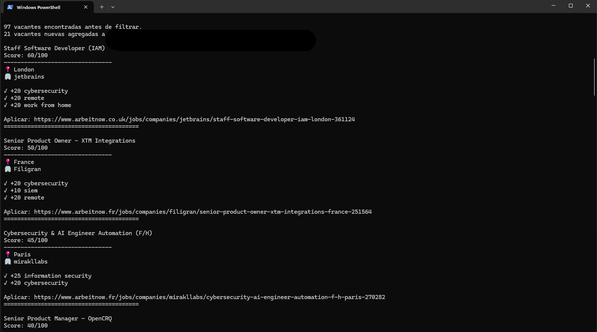

# job-hunter

Automatiza la búsqueda de trabajo: consulta varias fuentes de
vacantes, descarta lo irrelevante, puntúa cada vacante contra tu
perfil (título, ciberseguridad, redes, Linux, SIEM, remoto,
Hermosillo...), te manda notificación por Telegram, y además genera
enlaces de búsqueda directa para plataformas que no tienen API
pública (LinkedIn, Indeed, OCC, Computrabajo).

## Capturas

**Salida en terminal:**

**Notificaciones en Telegram:**

## Fuentes incluidas

| Fuente                          | Cobertura                          | Requiere API key |
|----------------------------------|-------------------------------------|-------------------|
| Remotive                         | Vacantes remotas                   | No |
| Arbeitnow                        | Remotas + presenciales, variadas   | No |
| Adzuna                           | México (localizado, por ciudad)    | Sí (gratis) |
| LinkedIn / Indeed / OCC / Computrabajo | Solo enlaces de búsqueda directa (sin scraping) | No |

Remotive, Arbeitnow y Adzuna son APIs oficiales/públicas. Para
LinkedIn, Indeed, OCC y Computrabajo **no se hace scraping** (viola
sus términos de servicio y arriesga que te bloqueen cuenta/IP) —
en su lugar el script arma la URL de búsqueda ya rellenada con tus
términos y ciudades, para que tú la abras manualmente.

## Instalación

Se recomienda usar un entorno virtual:

\`\`\`bash
python -m venv venv

# Windows (PowerShell)
venv\Scripts\Activate.ps1

# Linux/Mac
source venv/bin/activate

pip install -r requirements.txt
\`\`\`

Copia la plantilla de configuración y llena tus credenciales:

\`\`\`bash
cp config.example.yaml config.yaml
\`\`\`

\`config.yaml\` está en \`.gitignore\` y nunca se sube al repo — ahí van
tus credenciales reales.

## Activar Adzuna (recomendado para vacantes en México)

1. Regístrate gratis en https://developer.adzuna.com/signup
2. Copia tu \`app_id\` y \`app_key\`
3. En \`config.yaml\`, bajo \`sources.adzuna\`, pon \`enabled: true\` y
   pega tus credenciales. Puedes listar varias ciudades en
   \`locations\`.

## Activar notificaciones por Telegram

1. Habla con **@BotFather** en Telegram, \`/newbot\`, sigue los pasos
   → te da un \`bot_token\`.
2. Mándale un mensaje a tu bot recién creado.
3. Visita \`https://api.telegram.org/bot<TU_TOKEN>/getUpdates\` en el
   navegador y copia el valor de \`"chat":{"id": ...}\` → ese es tu
   \`chat_id\`.
4. En \`config.yaml\`, sección \`telegram\`, pon \`enabled: true\` y llena
   \`bot_token\` y \`chat_id\`.

Te llegará un mensaje por cada vacante que pase \`min_score\` (máx. 15
por corrida), más un resumen de los enlaces de búsqueda directa.

## Activar enlaces de búsqueda directa

En \`config.yaml\`, bajo \`sources\`, pon \`enabled: true\` en las
plataformas que quieras (\`linkedin\`, \`indeed\`, \`occ\`,
\`computrabajo\`). Reutilizan los mismos \`search_terms\` y \`locations\`
que configuraste en \`adzuna\`.

## Uso

\`\`\`bash
python -m src.main
\`\`\`

Esto:
1. Consulta cada fuente habilitada (Remotive, Arbeitnow, Adzuna).
2. Deduplica y aplica exclusiones duras (\`hard_excludes\` en config.yaml).
3. Puntúa cada vacante con la tabla de \`scoring\` en config.yaml.
4. Agrega las vacantes nuevas a \`data/jobs.csv\` (no se repiten entre corridas).
5. Imprime en consola las vacantes con score >= \`min_score\`.
6. Manda notificación por Telegram (si está activo).
7. Genera enlaces de búsqueda directa para LinkedIn/Indeed/OCC/Computrabajo
   y los exporta a \`data/quick_links.csv\`.

## Ajustar el scoring

Todo vive en \`config.yaml\`, sección \`scoring\`. Agrega o quita
términos y puntos sin tocar código:

\`\`\`yaml
scoring:
  positive:
    - term: "soc analyst"
      points: 30
  negative:
    - term: "ventas"
      points: -30
\`\`\`

El salario que reporta Adzuna es **anual**; el bono de salario se
compara automáticamente contra \`min_salary_mxn\` (mensual) dividiendo
entre 12.

## Automatizarlo (correr solo cada semana)

En Linux/Mac, con cron, para correr cada lunes a las 8am:

\`\`\`
0 8 * * 1 cd /ruta/a/job-hunter && /ruta/a/venv/bin/python -m src.main >> data/log.txt 2>&1
\`\`\`

Nota sobre cuota de Adzuna: el tier gratis da ~1000 requests/mes.
Cada corrida gasta (nº de términos × nº de ciudades) requests, así
que si tienes 5 términos y 8 ciudades son 40 por corrida — corriendo
una vez por semana estás muy por debajo del límite.
